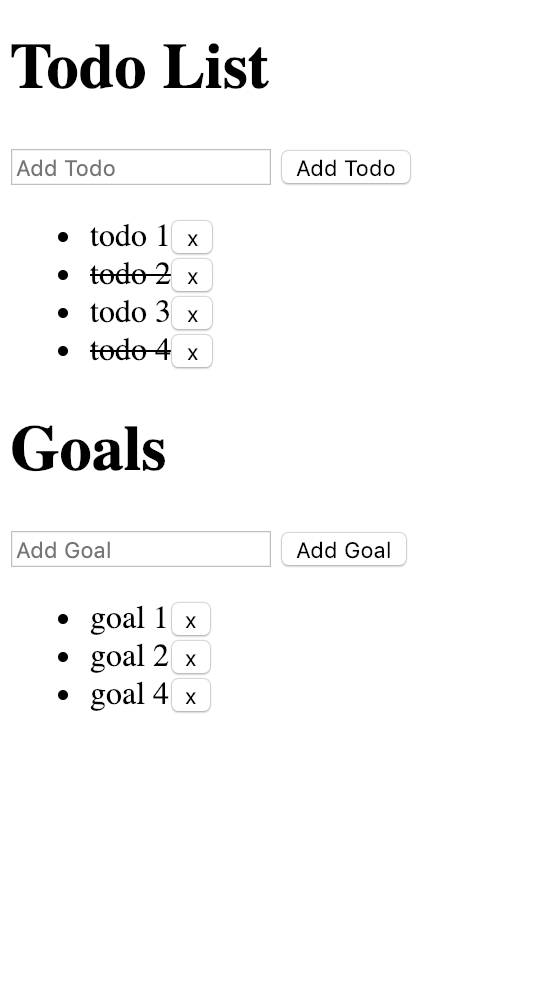

# The purpose of this project
This is a project which allows to see how the Redux and React libraries works together. 

Summary  
 - Shows how to convert a plain HTML application to one using React Components.   
 - Improve the code's organization by breaking out separate parts into reusable chunks. 
 - Shows how Redux can work with 2 states and 2 reducers
 - Use middleware for intercepting manipulation before actually dispatching the action.

Implemented functionality:

 * Todos 
   * add todo
   * remove todo
   * toggle todo  
  
 * Goals  
   * add goals
   * remove goal
    
 * Middleware
   * implement middleware to achieve the following behavior:  
     * Display an alert ` That's a great goal! ` whenever a new goal is added.
     * Display ` Don't forget to [name of your todo item]! ` whenever a new todo item is added.

# Runing the application
 - Open index.html in browser.
 

 
